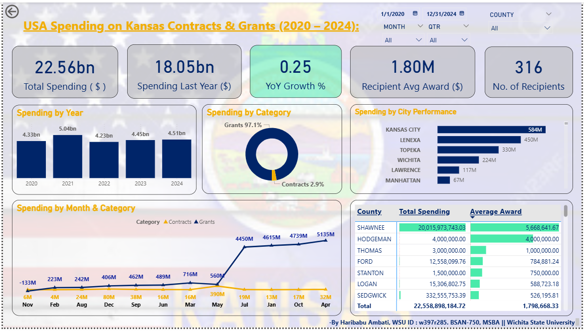

# Project 1 — Classic Visuals Dashboard

**USA Spending on Kansas Contracts & Grants (2020–2024)**  
Classic Power BI dashboard using standard visuals to analyze federal HHS funding across Kansas.

---

## Dashboard Preview

---

## What This Dashboard Shows

- **Total Spending:** \$22.56 billion across 2020–2024
- **YoY Growth %:** Peaked in 2021 (+16%), declined in 2022 (-16%), recovered through 2024
- **316 unique recipients** with an average award of \$1.80M
- **97.1% Grants vs 2.9% Contracts** funding split
- **Shawnee County** leads with \$20B total and \$5.67M average award
- **Kansas City** is the top-funded city at \$584M

---

## Visuals Used

| Visual | Purpose |
|---|---|
| KPI Cards (5) | Total Spending, Last Year Spending, YoY Growth %, Avg Award, Recipient Count |
| Column Chart | Spending by Year (2020–2024) |
| Donut Chart | Grants vs Contracts composition |
| Bar Chart | Top cities ranked by federal spending |
| Line Chart | Monthly spending trend split by category |
| Matrix | County-level spending + average award with conditional formatting |

---

## DAX Measures

- `Total Spending ($)` — SUM of federal_action_obligation
- `Total Spending Last Year ($)` — DATEADD offset by -1 YEAR
- `YoY Growth %` — DIVIDE of current vs prior year delta
- `Recipient Avg Award ($)` — average obligation per unique recipient
- `Distinct Recipients` — DISTINCTCOUNT on recipient_uei

---

## Data

- **Source:** USAspending.gov
- **Rows:** 12,542 records
- **Files merged:** 10 CSVs (Grants + Contracts for each year 2020–2024)
- **Key field:** federal_action_obligation (transaction-level spending value)

---

## Tools

Power BI Desktop | DAX | Power Query | USAspending.gov

---

*BSAN-750: Data Visualization | Fall 2025 | Wichita State University*
