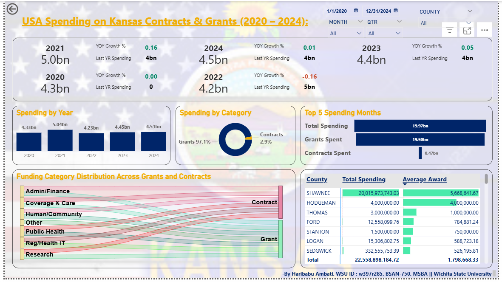

@"
# Project 2 — Advanced Visuals Dashboard

**USA Spending on Kansas Contracts & Grants (2020–2024)**  
Advanced Power BI dashboard built on Project 1, adding multi-line KPI cards, a Funnel chart, and a Sankey diagram for deeper analytical storytelling.

---

## Dashboard Preview

---

## What This Dashboard Adds (vs Project 1)

- **Advanced multi-line KPI cards** — each year shows spending, YoY Growth %, and last year benchmark side by side
- **Funnel chart** — hierarchical breakdown: Total Spending → Grants Spent → Contracts Spent
- **Sankey diagram** — shows how 7 funding categories (Public Health, Coverage & Care, Human/Community, etc.) flow into Grants vs Contracts
- **Conditional formatting** retained from Project 1 with enhanced color hierarchy

---

## Key Insights

- 2022 saw a **-16% YoY decline**, followed by recovery in 2023 (+5%) and 2024 (+1%)
- Out of **\$19.97B** in top-5 spending months, **\$19.50B came from Grants** and only **\$0.47B from Contracts**
- **Public Health** and **Coverage & Care** categories drive the strongest grant flows per the Sankey diagram
- Kansas's heavy grant dependency (~97%) makes it vulnerable to federal policy shifts — diversifying into contracts is a strategic recommendation

---

## Visuals Used

| Visual | Type | Purpose |
|---|---|---|
| Multi-line KPI Cards | Advanced | Year-by-year spending + YoY Growth + last year benchmark |
| Column Chart | Classic | Annual spending trend 2020–2024 |
| Donut Chart | Classic | Grants vs Contracts composition |
| Funnel Chart | Advanced | Total → Grants → Contracts spending breakdown |
| Sankey Diagram | Advanced | Funding category flow into Grants and Contracts |
| Matrix | Classic | County-level spending + average award |

---

## Advanced DAX Measures Added

- `Grants Spending` — CALCULATE with Source_Type = "Grant", COALESCE null-safe
- `Contracts Spending` — CALCULATE with Source_Type = "Contract", COALESCE null-safe

---

## Data

Same dataset as Project 1 — 12,542 records from USAspending.gov (2020–2024)

---

## Tools

Power BI Desktop | DAX | Power Query | Sankey Chart visual | USAspending.gov

---

*BSAN-750: Data Visualization | Fall 2025 | Wichita State University*
"@ | Out-File -FilePath "project2-advanced\README.md" -Encoding utf8